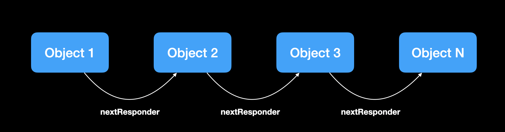
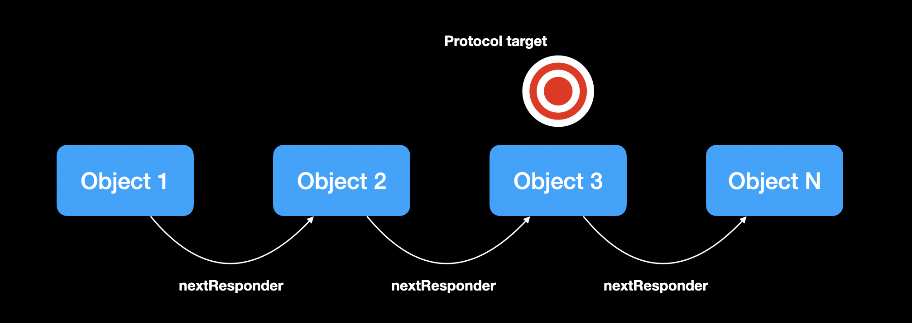

# Responder

Responder is a Package that provides one way of sending your data through a chain of responsibility using the better implementation protocol based on delegate pattern and the better that notification center provides

## How to use this package?

It's very simple, at first, we just implement protocol `Responder` where we want to create a linked list based on value type or reference, look at the example below:

```swift

struct Object: Responder {
    var nextResponder: Responder?
}

```



## Why do we want to do it?

Basically, we want to send data through this list and we need to anyone respond if can execute or not, and how can we do it? the idea beyond this implementation is to have a fusion of delegate pattern and notification center using chain responsibility



Following this example, we need to walk each object and wonder if we can execute or not execute an action if not then we wonder to next into the chain 

```swift

protocol ActionProtocol {
    func send(event: Action)
}

enum Action: Event {
    case here

    func sendToHandler(_ handler: ActionProtocol) {
        handler.send(event: self)
    }
}

```

In this case, the protocol `Action Protocol` is just only used as a protocol of validation who will be executed whether has found on chain. An `Event` is the protocol that we need to implement and who we'll send through the chain, easy easy right!

## How do we send an event?

Don't worry, it's very much simples what you imagine!

```swift

object.tryToHandle(Action.here)

```

Do you see? it's simple


## Ideas to use

### Coordinator parttern

We can use this to avoid delegate pattern where usually we create to property reference to set values to delegate for each node to three for coordinators

### Interceptor parttern

Here the use is basic, we can shift array by default and create a chain list and each element can respond specific action

## How to install this?

### Swift Package Manager

To use `Responder` as a [Swift Package Manager](https://swift.org/package-manager/) package just add the following in your Package.swift file.

``` swift

.package(url: "https://github.com/bfernandesbfs/Responder.git", .upToNextMajor(from: "1.0.0"))

```
## License

[Here](./LICENSE)
